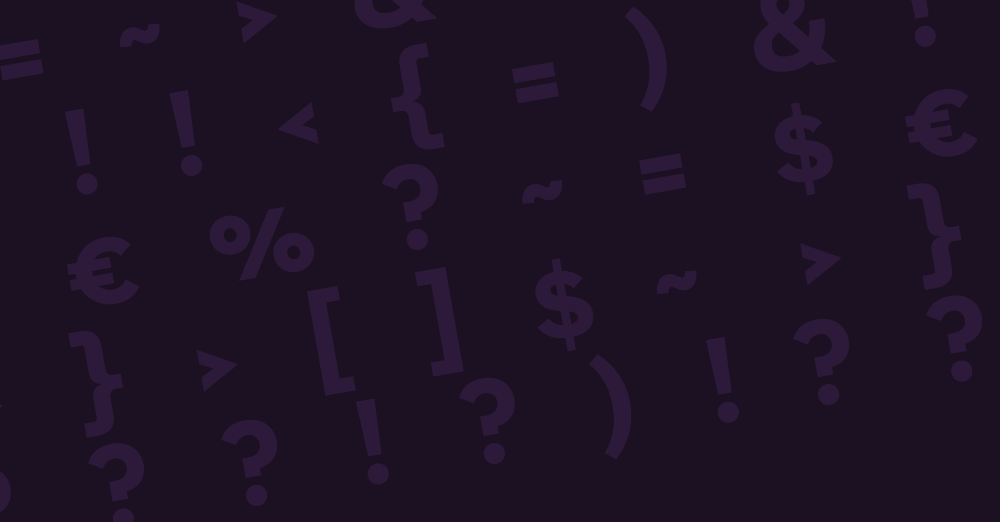

# Type-safe, functional React with ReasonML

### [fit] QueerJS Internet Meetup 🏳️‍🌈
### @bogardguillaume - guillaumebogard.dev



---


# Hello there!

My name is **Guillaume Bogard**, I'm a Scala developer [@Linkvalue](https://link-value.fr/fr).

I ❤️ functional programming and teach it through blog posts, talks, and in-person training.

My hobbies include going to the movies, playing strategy games and riding roller coasters 🎢

---

# What is ReasonML?

---


- Not an entirely new language. Reason is essentially equivalent to OCaml 🐫 (strong foundations!)
- Its syntax is inspired by Javascript (easy adoption!)
- It has easy interop with Javascript (#usetheplarform!)
- It's *fast* (blazing-fast compilation + clean Javascript output!) 

<br />

We use *Bucklescript* to compile ReasonML code to Javascript.
We can also compile ReasonML to native code, 
it's just Ocaml with makeup after all 💄

---

It has React as originally intended: functional, easy 
and type-safe. Don't take it from me:

<br />

> I see ReasonML as a way to unlock a much more ambitious future
for UI development.

Jordan Walke, original author of React and ReasonML, 
[React to the future (talk on YouTube)](https://www.youtube.com/watch?v=5fG_lyNuEAw)

---

# What's in the talk

- Spinning up a new React app in no time
- JSX support and CSS-in-JS
- Modules
- Records and other types
- Variants and pattern matching
- Functional composition and currying

Let's go!

---

# ReasonReact
## UI development, easy peasy

---

ReasonReact is the official React binding for ReasonML.

- It has 100% feature-parity with vanilla React
- It supports JSX
- It works with React Native and Preact
- There are bindings for popular UI tools such as:
  - CSS-in-JS with a type-safe binding to *emotion*
  - Snapshot testing via *Jest*
  - Visual component development via *Storybook*

---

Spinning up a ReasonReact is as easy as 

```
npm install -g spin

spin new bs-react my_app
cd my_app

yarn start
```

Props to Thibaut Mattio for the awesome `spin` scaffolding tool

---


## Here comes the demo 🍿

---

### One more thing
# Is it production ready?

---

# It sure is!

---


## Thank you for having me! 💖

##### If you want to keep in touch: @bogardguillaume

